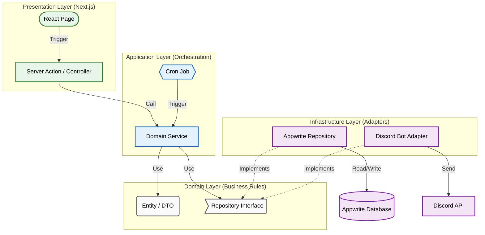

# Tau Nu Fiji • The Digital Chapter 🦅

> **Role-Based Operations System for Phi Gamma Delta (Tau Nu Chapter)**
>
> _A production-grade, event-driven web application powering the daily logistics, finance, and academics of a fraternity chapter._

---

## 📖 Executive Summary

**Tau Nu Fiji** serves as the central operating system for a 100+ member organization. It modernizes chapter operations by replacing disparate spreadsheets with a unified, secure, and gamified digital platform.

The system is engineered to solve three specific problems:

1.  **Accountability at Scale**: Automating the "assignment-to-verification" pipeline for housing duties.
2.  **Institutional Memory**: Preserving decades of academic resources in a searchable, RBAC-protected archive.
3.  **Financial Integrity**: Enforcing a double-entry ledger for non-monetary "Scholarship Points".

---

## 🏗️ Architectural Deep Dive

The application is built on a **Clean Architecture (Onion)** foundation, prioritizing the separation of business rules from implementation details. This ensures the system remains testable and agnostic to underlying infrastructure changes.

### 🏗️ Architectural Pattern

The system implements **Clean Architecture**, strictly enforcing the Dependency Rule. Inner layers (Domain) are independent of outer layers (Infrastructure/Presentation).

**Key Principals Enforced:**

1.  **Dependency Rule**: Source code dependencies only point inwards. The `Domain` knows nothing about the `Database`.
2.  **Separation of Concerns**: UI (React) is completely decoupled from Business Logic (Services).
3.  **Testability**: The `Application` layer can be tested in isolation by mocking the `Infrastructure` interfaces.

### 1. Domain Layer (`lib/domain`)

The heart of the software. Contains **zero external dependencies**.

- **Entities**: Pure TypeScript classes defining core business objects (`HousingTask`, `LedgerEntry`).
- **Ports**: Interface definitions for external systems (`ITaskRepository`, `INotificationProvider`).
- **DTOs**: Strict Zod schemas defining data contracts for Server Actions.

### 2. Application Layer (`lib/application`)

Orchestrates business logic and Use Cases.

- **Services**: `DutyService`, `LedgerService`, `LibraryService`.
- **Event Handlers**: Asynchronous listeners for domain events (e.g., `JobCompletedEvent`).
- **Scheduling**: Cron handlers (`lib/application/services/jobs`) for recurring logic.

### 3. Infrastructure Layer (`lib/infrastructure`)

Concrete implementations of Domain Ports.

- **Dependency Injection**: A custom IoC Container (`container.ts`) lazy-loads dependencies, enabling robust unit testing via mock injection.
- **Persistence**: Repository pattern implementation using the **Appwrite Node.js SDK**.
- **Messaging**: Discord Bot integration for real-time notifications via Webhooks.

### 4. Presentation Layer (`app`)

- **Server Actions**: Secured entry points using a Higher-Order Function (`actionWrapper`) that safeguards every mutation with:
  1.  **Authentication**: JWT verification.
  2.  **Dependency Injection**: Context provisioning.
  3.  **Authorization**: RBAC checks against Discord Roles.
  4.  **Error Handling**: Standardized error envelopes.

---

## ⚡ Key Engineering Modules

### 🏠 Housing: The Recurring Engine

_Problem: Fairness and manual overhead in chore assignment._

The Housing module uses a weighted Round-Robin algorithm to assign duties.

- **Cron Architecture**: A Next.js API Route (`/api/cron/housing`) triggers the `ScheduleService`.
- **State Machine**: Tasks move through a strict lifecycle: `Scheduled -> Open -> Pending Review -> Approved/Rejected`.
- **Optimistic UI**: Client components utilize `router.refresh()` for mutations, providing near-instant feedback while preserving server state consistency.

### 💰 Ledger: Double-Entry Accounting

_Problem: Point inflation and lack of auditability._

Unlike typical "score counters," the Ledger system treats points as currency.

- **Atomicity**: Every point change records a `LedgerEntry` transaction with a source (e.g., `SYSTEM_MINT`) and destination (`USER_WALLET`).
- **Event-Driven**: The `PointsService` listens for `TaskApproved` events to automatically execute transfers, decoupling the financial logic from the operational logic.

### 📚 Library: Secure Archives

_Problem: Loss of academic resources over time._

- **Metadata Strategy**: Resources are indexed by complex metadata (Professor, Course Number, Semester) rather than simple folders.
- **Security**: S3 Download URLs are signed on-demand with a 15-minute TTL (Time-To-Live), preventing link sharing with unauthorized users.
- **RBAC**: Access is strictly limited to users with the verified `Brother` role.

---

## 🛡️ Security & DevOps Standard

### Role-Based Access Control (RBAC)

We do not rely on simple "Admin" flags. Access is determined by **Discord Roles**, verified in real-time via the Discord API.

- **Access Gates**: `Brother`, `Cabinet`, `Housing Chair`.
- **Middleware**: Server Actions utilize a `verifyRole` guard to protect sensitive operations.

### CI/CD Pipeline

Code quality is enforced via GitHub Actions (`.github/workflows/ci.yml`).

- **Static Analysis**: ESLint + Prettier.
- **Type Safety**: TypeScript Strict Mode check (`tsc --noEmit`).
- **Build Verification**: Full production build (`next build`) runs on every Pull Request to prevent regressions.

---

_Engineered by [Patrick Carlson](https://github.com/pdcarlson) for Phi Gamma Delta._
