# 🚀 Deployment Workflow Guide

This document outlines the complete lifecycle of a code change in `taunufiji-dot-app`, from local development to production deployment.

## 📊 The "Life of a Feature" Pipeline

```mermaid
graph TD
    A[Local Dev] -->|git push| B(Feature Branch)
    B -->|Open PR| C{Pull Request Checks}
    C -->|Run ci.yml| D[Lint / Type Check / Test]
    D -->|❌ Fail| E[Fix Code]
    E --> B
    D -->|✅ Pass| F[Merge to 'staging' branch]
    F -->|Trigger| G{Staging CI & Appwrite Deploy}
    G -->|Run ci.yml| H[Quality Gates]
    G -->|Direct Integration| I[Deploy to Staging Appwrite]
    I --> J[Manual QA on Staging]
    J -->|✅ Approved| K[Merge to 'main' branch]
    K -->|Trigger| L{Production CI & Appwrite Deploy}
    L -->|Run ci.yml| M[Quality Gates]
    L -->|Direct Integration| N[Deploy to Production Appwrite]
```

---

## 1. Quality Gates (`ci.yml`)

**Trigger**: Opening a PR, pushing to `main`, or pushing to `staging`.
**Goal**: Ensure code quality before merging or during a deployment cycle.

- **What happens**:
  - Installs dependencies.
  - Lint the code with `npm run lint`.
  - Type-check the project with `npx tsc`.
  - Execute unit tests via `npm run test`.
  - Build the project using `npm run build`.
- **Integration Note**: This workflow does **NOT** handle the actual deployment. It serves strictly as a quality gate (CI).

## 2. Staging Deployment (Appwrite Integration)

**Trigger**: Pushing to the `staging` branch (usually via PR merge).
**Goal**: Create a production-like environment for verification.

- **Mechanism**: Appwrite is connected directly to the GitHub repository. It listens for pushes to the `staging` branch and automatically triggers a build and deployment to the Staging Appwrite Site.
- **Secrets**: Environment variables (`.env` equivalents) are managed directly within the Appwrite console for the Staging project.

## 3. Production Deployment (Appwrite Integration)

**Trigger**: Pushing to the `main` branch.
**Goal**: Release to the real world.

- **Mechanism**: Appwrite is connected directly to the GitHub repository. It listens for pushes to the `main` branch and automatically triggers a build and deployment to the Production Appwrite Site.
- **Secrets**: Environment variables are managed directly within the Appwrite console for the Production project.

---

## 🧠 "Think It Through": F.A.Q

### Q: "Where did the GitHub Actions deployment scripts go?"

**A:** They were removed. Direct Appwrite/GitHub integration is simpler, faster, and keeps secret management centralized within the hosting platform itself rather than duplicating secrets in GitHub Environments.

### Q: "What do I wait for?"

1. **After PR Merge to Staging**:
   - Check the GitHub Actions tab for the `ci.yml` quality gate.
   - Check the Appwrite Console (Staging Project) to monitor the deployment build.
   - Once green, check the Staging URL.
2. **After Merge to Main**:
   - Check the Appwrite Console (Production Project) to monitor the deployment build.

### Q: "Single Source of Truth?"

**Yes.**

- **Secrets**: Managed in the Appwrite Console for their respective environments (and locally in `.env.local` for development).
- **Code**: Managed in GitHub.
- **Infra**: Deploys are handled automatically by Appwrite on branch pushes.
