# 🚀 Deployment Workflow Guide

This document outlines the complete lifecycle of a code change in `taunufiji-dot-app`, from local development to production deployment.

## 📊 The "Life of a Feature" Pipeline

```mermaid
graph TD
    A[Local Dev] -->|git push| B(Feature Branch)
    B -->|Open PR| C{Pull Request Checks}
    C -->|Run ci.yml| D[Lint / Type Check / Test]
    D -->|❌ Fail| E[Fix Code]
    E --> B
    D -->|✅ Pass| F[Merge to 'staging' branch]
    F -->|Trigger| G{Staging Deploy}
    G -->|Run deploy-staging.yml| H[1. Sync DB from Prod]
    H -->|2. Build App| I[3. Deploy to Staging]
    I --> J[Manual QA on Staging]
    J -->|✅ Approved| K[Create Release Tag v*]
    K -->|Trigger| L{Production Deploy}
    L -->|Run deploy-prod.yml| M[1. Build App]
    M -->|2. Deploy to Production| N[🎉 LIVE]
```

---

## 1. Pull Request Checks (`ci.yml`)

**Trigger**: Opening a PR or pushing to a PR branch.
**Goal**: Ensure code quality before merging.

- **What happens**:
  - Installs dependencies.
  - Runs `npm run lint`.
  - Runs `npx tsc` (Type Check).
  - Runs `npm run test` (Unit Tests).
- **Integration Note**: We do **NOT** deploy to staging here. Staging is a shared environment; deploying on every PR would cause conflict and instability.

## 2. Staging Deployment (`deploy-staging.yml`)

**Trigger**: Pushing to `staging` branch (usually via PR merge).
**Goal**: Create a production-like environment with fresh data for verification.

- **Environment**: GitHub Environment `staging`.
- **Steps**:
  1.  **Sync Database** (`sync-staging.ts`):
      - **Input**: Reads `PROD_API_KEY` to fetch data from Production.
      - **Action**: Clones schemas + Copies data (`users`, `professors`, `courses`, `ledger`, `library_resources`).
      - **Safety**: Skips `housing_schedules` data (schema only) to prevent accidental notifications (DM spam).
      - **Failure**: If sync fails (e.g. timeout), the deploy **continues** (marked `continue-on-error: true`).
  2.  **Build**:
      - Injects staging secrets (`NEXT_PUBLIC_*`) into the build.
  3.  **Deploy**:
      - Pushes the build to the **Staging Appwrite Site**.

## 3. Production Deployment (`deploy-prod.yml`)

**Trigger**: Pushing a tag starting with `v` (e.g., `v1.0.1`).
**Goal**: Release to the real world.

- **Environment**: GitHub Environment `production`.
- **Steps**:
  1.  **Build**:
      - Injects production secrets (`NEXT_PUBLIC_*`) into the build.
  2.  **Deploy**:
      - Pushes the build to the **Production Appwrite Site**.

---

## 🧠 "Think It Through": F.A.Q.

### Q: "Should we integrate deploy into PR checks?"

**A: No.** PR checks should be fast and stateless. Deploying a full Appwrite site and syncing a database on every PR commit is:

1.  **Too Slow**: You'd wait 5+ mins for every typo fix.
2.  **Destructive**: One PR's sync would overwrite another's.
3.  **Complex**: Managing unique URLs for every PR is overkill for this project size.

### Q: "What do I wait for?"

1.  **After PR Merge**: Wait ~2-3 minutes for `deploy-staging.yml` to finish.
    - Go to **Actions** tab in GitHub to watch it.
    - Once green, check the Staging URL.
2.  **After Tagging**: Wait ~2 minutes for `deploy-prod.yml` to finish.

### Q: "What if Sync fails?"

The workflow is configured to **continue** (`continue-on-error: true`).

- **Consequence**: Staging might have slightly stale data (from the last successful sync).
- **Fix**: You can manually trigger the sync locally (`npx tsx scripts/sync-staging.ts`) or re-run the GitHub Action.

### Q: "Single Source of Truth?"

**Yes.**

- **Secrets**: All managed in GitHub Environments (`production` and `staging`).
- **Code**: All managed in GitHub.
- **Infra**: Deploys are automated. No one manually uploads files from their laptop anymore.
